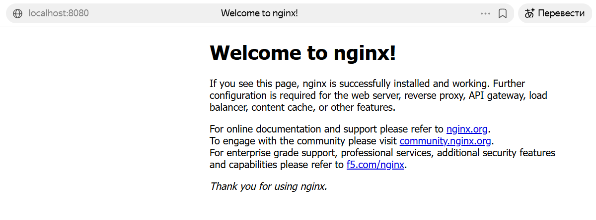
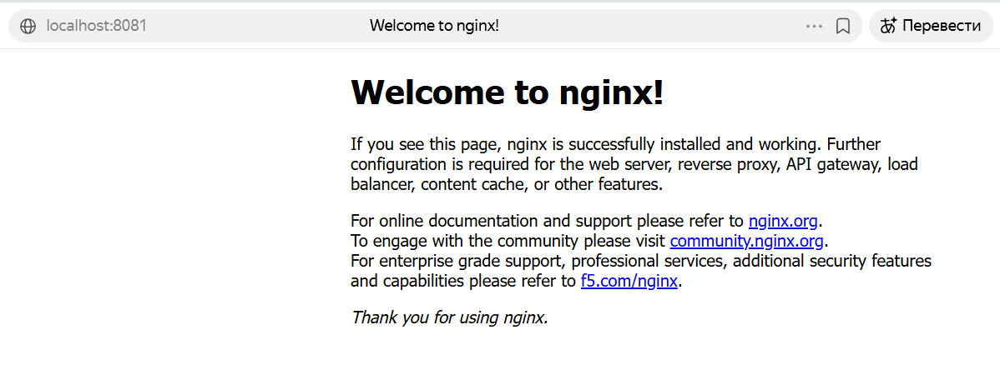
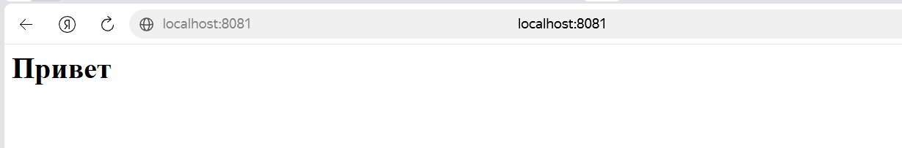
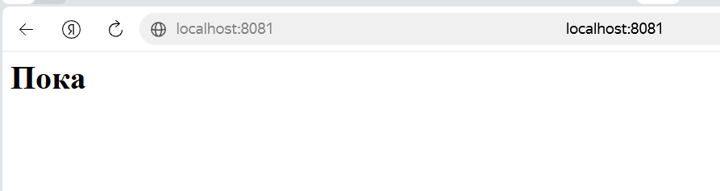
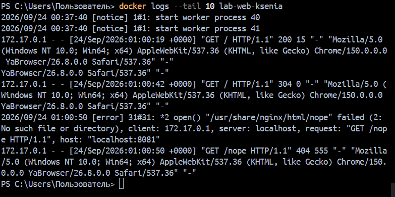
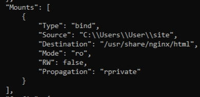
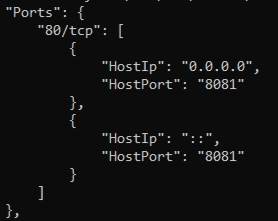
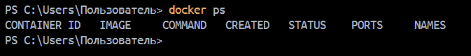
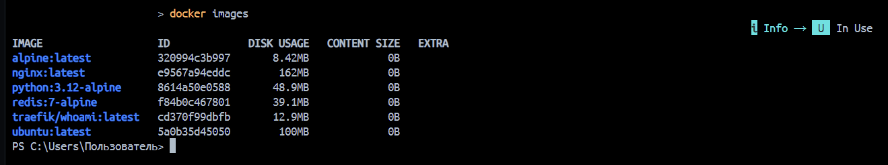

## Среда
---
- **ОС:** Windows 11
- **Docker Desktop:** 4.92.0 (240144)
- **Docker Client:** 29.8.0
- **Docker Engine (Server):** 29.8.0
- **Терминал:** Windows PowerShell
- **Базовый образ для лабы:** nginx:1.31.6-alpine

## Задания
---
### 1) Версии и теги
- **Определение версии клиента и демона Docker:**
	```powershell
	  docker version 
	```
	Из вывода находим строчки, указывающие на версию клиента:
	```powershell
	Client:
	 Version:           29.8.0
	```
	и версию демона Docker:
	```powershell
	Server: Docker Desktop 4.92.0 (240144)
	 Engine:
	  Version:          29.8.0
	```
	Команда выводит полную информацию о двух компонентах Docker: клиенте (CLI, через который мы отправляем команды) и демоне (серверная часть, которая управляет контейнерами, образами, сетями и томами). Клиент и демон могут иметь разные версии — это нормально, главное, чтобы они были совместимы.

  - **Запуск образа `nginx:alpine` в конкретном теге (не `latest`).**
    Смотрим актуальные теги на [hub.docker.com//nginx](https://hub.docker.com/_/nginx) . Я выбрала 1.31.6-alpine.
	```powershell
	  docker run -d --name lab-web-ksenia -p 8080:80 nginx:1.31.6-alpine
	```
	В выводе видим:
	```powershell
	Unable to find image 'nginx:1.31.6-alpine' locally
	1.31.6-alpine: Pulling from library/nginx
	Digest: sha256:d10753d9289b8e3f884386351f73554ce72b631378949deddd75e83ee296c427
	Status: Downloaded newer image for nginx:1.31.6-alpine
	60fd32db29ae33efbf4969bf47f28f5b0daaea12e4f3353b72cf7f7fa24cdb0f
	```
	Или проще:
	```powershell
  	docker run --rm nginx:1.31.6-alpine
  	```
  	`--rm` для автоматического удаления контейнера после выполнения команды (остановки работы контейнера с помощью `Ctrl + C` или другим способом).
	Конкретный тег важен для воспроизводимости: `latest` может в любой момент обновиться до несовместимой версии, а фиксированный тег гарантирует, что завтра образ будет тем же, что и сегодня.

Ссылки на раздел лекций:
 - Лекция 1: "Установка Docker Desktop и подключение к Docker Hub", "Hello World через GUI Docker Desktop"

### 2) Первый запуск сервиса (detached)
- **Запуск контейнера в фоновом режиме с именем `lab-web-ksenia` и доступом по `http://localhost:8080`.**
    ```powershell
	  docker run -d --name lab-web-ksenia -p 8080:80 nginx:1.31.6-alpine
	```
	Разберем флаги:
	- `-d` — запуск в **detached-режиме** (в фоне), терминал остаётся свободным. Используется для сервисов, которые должны работать постоянно.
	- `--name lab-web-ksenia` — задаём **своё имя** контейнеру вместо автоматически сгенерированного (`zealous_poincare` и т.п.). Это упрощает управление: можно обращаться по имени, а не по ID.
	- `-p 8080:80` — **проброс портов**: порт 80 внутри контейнера становится доступен на порту 8080 хоста. Формат `ХОСТ:КОНТЕЙНЕР`.
	
- **Перезапуск сервиса на порту `8081:80`:**
	```powershell
	PS C:\Users\Пользователь> docker ps
	CONTAINER ID   IMAGE                 COMMAND                  CREATED         STATUS         PORTS                                     NAMES
	5f00aabf388f   nginx:1.31.6-alpine   "/docker-entrypoint.…"   8 minutes ago   Up 8 minutes   0.0.0.0:8080->80/tcp, [::]:8080->80/tcp   lab-web-ksenia
	PS C:\Users\Пользователь> docker stop lab-web-ksenia
	lab-web-ksenia
	PS C:\Users\Пользователь> docker rm lab-web-ksenia
	lab-web-ksenia
	PS C:\Users\Пользователь> docker ps
	CONTAINER ID   IMAGE     COMMAND   CREATED   STATUS    PORTS     NAMES
	PS C:\Users\Пользователь>   docker run -d --name lab-web-ksenia -p 8081:80 nginx:1.31.6-alpine
	072e89216e60b3bdb28927af1b2387c706f41a5f91338e3cd6093422248163fc
	PS C:\Users\Пользователь> docker ps
	CONTAINER ID   IMAGE                 COMMAND                  CREATED         STATUS         PORTS                                     NAMES
	072e89216e60   nginx:1.31.6-alpine   "/docker-entrypoint.…"   4 seconds ago   Up 4 seconds   0.0.0.0:8081->80/tcp, [::]:8081->80/tcp   lab-web-ksenia
	```
	- `docker stop` — корректно останавливает контейнер (посылает SIGTERM, потом SIGKILL при необходимости). Контейнер переходит в статус `Exited`.
	- `docker rm` — удаляет остановленный контейнер. Без этого имя `lab-web-ksenia` останется занятым, и новый контейнер с тем же именем не запустится.
	
	**Порт 8081 зафиксирован как рабочий для всех последующих заданий.**

Ссылки на раздел лекций:
- -p - Лекция №3, пункт №3
- -d - Лекция №2, пункт №9,10

### 3) Том (bind‑mount): сайт/данные из папки хоста
- **Создание папки на хосте с тестовым файлом (`site/index.html`).**
    ```powershell
    PS C:\Users\Пользователь> mkdir site


    Каталог: C:\Users\Пользователь


	Mode                 LastWriteTime         Length Name
	----                 -------------         ------ ----
	d-----        24.09.2026      1:23                site


	PS C:\Users\Пользователь> "<h1>Привет</h1>" | Set-Content .\site\index.html               
	PS C:\Users\Пользователь> Get-Content .\site\index.html
	<h1>Привет</h1>
    ```
    
- **Перезапуск `lab-web-<USERNAME>`, смонтировав папку как read‑only.**
    ```powershell
    PS C:\Users\Пользователь> docker stop lab-web-ksenia
	lab-web-ksenia
	PS C:\Users\Пользователь> docker rm lab-web-ksenia
	lab-web-ksenia
	PS C:\Users\Пользователь> docker run -d --name lab-web-ksenia -p 8081:80 -v "${PWD}\site:/usr/share/nginx/html:ro" nginx:1.31.6-alpine
	7345a96da6a88ce415c8d215a3726a83d89e72721431d6d06ed6c104fd40dd54
    ```
    Пояснения к команде:
    - `-v "${PWD}\site:/usr/share/nginx/html:ro"` — монтируем папку `site` с хоста в папку `/usr/share/nginx/html` внутри контейнера.
	    - `${PWD}` — текущая папка PowerShell (аналог `$PWD` в bash). 
	    - `/usr/share/nginx/html` — стандартная папка статики nginx.
	    - `:ro` — **read-only**: контейнер может читать файлы, но не может их изменять или создавать новые.
	- Формат `-v`: сначала **HOST**, потом **CONTAINER**. Легко запомнить: «откуда → куда».
	

- **Изменение файла на хосте, обновление страницы.**
	```powershell
	PS C:\Users\Пользователь> "<h1>Пока</h1>" | Set-Content .\site\index.html  
	```
    
    Данные в bind-mount хранятся **на хосте** в папке `site`, а не внутри контейнера. Контейнер лишь «смотрит» на эту папку через точку монтирования. Когда контейнер удаляется, Docker удаляет только его собственную файловую систему (writable layer), но **не трогает папки хоста**. Поэтому файл `index.html` останется на месте, и если запустить новый контейнер с тем же `-v`, он снова увидит этот файл.
	```powershell
	PS C:\Users\Пользователь> docker stop lab-web-ksenia
	lab-web-ksenia


    Каталог: C:\Users\Пользователь\site


	Mode                 LastWriteTime         Length Name
	----                 -------------         ------ ----
	-a----        24.09.2026      1:36             15 index.html


	```

Ссылки на разделы лекций:
- Том - Лекция №3, пункт №5

### 4) Интерактив / exec
- **Вход внутрь работающего контейнера `lab-web-<USERNAME>` интерактивно.**
```powershell
docker exec -it lab-web-ksenia /bin/sh
```
Разберем флаги:
	- `docker exec` — запускает **новый процесс** внутри уже работающего контейнера (в отличие от `attach`, который подключается к главному процессу).
	- `-i` — интерактивный режим, подключает stdin (для ввода команд).
	- `-t` — выделяет псевдотерминал (чтобы оболочка работала как в обычном терминале).
	- `/bin/sh` — команда, которую запускаем. В Alpine Linux есть `/bin/sh` (легковесный shell), но нет `bash`.
	
- **Просмотр содержания каталога со статикой (по пути `/usr/share/nginx/html`):**

Здесь виден файл `index.html` — тот самый, что мы создали на хосте. Через bind-mount он «проброшен» внутрь контейнера. Контейнер видит его как обычный файл, не подозревая, что физически тот лежит на хосте.

- **Проверка поведения с `read-only`: попытка создания файла внутри каталога статики:**
```powershell
touch /usr/share/nginx/html/ex.txt
touch: /usr/share/nginx/html/ex.txt: Read-only file system   <-Ошибка
```
Флаг `:ro` в точке монтирования делает папку доступной только для чтения. Ядро Linux блокирует любые операции записи в неё, даже для root-пользователя внутри контейнера. Это защита от случайного изменения данных из контейнера.

- **Перезапуск `lab-web-ksenia` с тем же bind-mount без `:ro(read-write)` и повторное создание файла:**
```powershell
PS C:\Users\Пользователь> docker stop lab-web-ksenia 
lab-web-ksenia
PS C:\Users\Пользователь> docker rm lab-web-ksenia   
lab-web-ksenia
PS C:\Users\Пользователь> docker run -d --name lab-web-ksenia -p 8081:80 -v "${PWD}\site:/usr/share/nginx/html" nginx:1.31.6-alpine   
59f21861974cb7723c20340b15595a4e7b7c7acbc08240cd072cdb2953c6f890
```
По умолчанию bind-mount монтируется в режиме read-write. Если явно не указывать `:ro`, контейнер сможет создавать, изменять и удалять файлы в смонтированной папке — и эти изменения сразу отразятся на хосте.
```
PS C:\Users\Пользователь> docker exec -it lab-web-ksenia /bin/sh                   
/# touch /usr/share/nginx/html/ex.txt
```
Убедимся, что он появился на хосте:
```powershell
PS C:\Users\Пользователь> ls .\site
    Каталог: C:\Users\Пользователь\site

Mode                 LastWriteTime         Length Name
----                 -------------         ------ ----
-a----        24.09.2026      3:40              0 ex.txt
-a----        24.09.2026      1:36             15 index.html
```
Файл `ex.txt`, созданный внутри контейнера, появился на хосте в папке `site`. Это наглядно показывает, что bind-mount — это **двусторонний канал**: изменения видны в обе стороны (хост → контейнер и контейнер → хост).

Ссылки на разделы лекций 
- Exec - Лекция №2, пункт №9
- Detached-режим - Лекция №2, пункт №10

### 5) Логи и attach
- **Генерация HTTP-запросов:** 
	откроем страницу сервиса в браузере(http://localhost:8081) несколько раз; обновим; попробуем несуществующий путь (http://localhost:8081/nope) для 404.

- **Просмотр последних строк журнала контейнера:**
	С помощью команды `docker logs --tail 10 lab-web-ksenia`:

Флаг `--tail 10` показывает **последние 10 строк**. Без него вывелись бы все логи с момента запуска.
Заметим, что после первой загрузки статус 200(ОК) сменился на 304(Not Modified), а при переходе на несуществующий путь стал 404(Not Found).

- **Прикрепление к основному процессу контейнера, затем корректная отстыковка(без его остановки).** 
	Для прикрепления используем команду `docker attach lab-web-ksenia`.
	После перезагрузимся в интерактивном режиме, для выхода из attach нажимаем сочетание Ctrl + P + Q:
```powershell
PS C:\Users\Пользователь> docker stop lab-web-ksenia                         
lab-web-ksenia
PS C:\Users\Пользователь> docker rm lab-web-ksenia
lab-web-ksenia
PS C:\Users\Пользователь> docker run -dit --name lab-web-ksenia -p 8081:80 -v "${PWD}\site:/usr/share/nginx/html" nginx:1.31.6-alpine   
6080520b34f9ad117b2cc5e90de0dfac6105f9297cdea7d8cbebe1c37717da76
PS C:\Users\Пользователь> docker attach lab-web-ksenia
2026/09/24 01:09:53 [notice] 41#41: signal 28 (SIGWINCH) received
2026/09/24 01:09:53 [notice] 39#39: signal 28 (SIGWINCH) received
2026/09/24 01:09:53 [notice] 40#40: signal 28 (SIGWINCH) received
172.17.0.1 - - [24/Sep/2026:01:10:26 +0000] "GET / HTTP/1.1" 304 0 "-" "Mozilla/5.0 (Windows NT 10.0; Win64; x64) AppleWebKit/537.36 (KHTML, like Gecko) Chrome/150.0.0.0 YaBrowser/26.8.0.0 Safari/537.36" "-"
172.17.0.1 - - [24/Sep/2026:01:10:27 +0000] "GET / HTTP/1.1" 304 0 "-" "Mozilla/5.0 (Windows NT 10.0; Win64; x64) AppleWebKit/537.36 (KHTML, like Gecko) Chrome/150.0.0.0 YaBrowser/26.8.0.0 Safari/537.36" "-"
172.17.0.1 - - [24/Sep/2026:01:10:27 +0000] "GET / HTTP/1.1" 304 0 "-" "Mozilla/5.0 (Windows NT 10.0; Win64; x64) AppleWebKit/537.36 (KHTML, like Gecko) Chrome/150.0.0.0 YaBrowser/26.8.0.0 Safari/537.36" "-"
read escape sequence <---Здесь Зажали сочетание Ctrl + P и Ctrl + Q
PS C:\Users\Пользователь> docker ps
CONTAINER ID   IMAGE                 COMMAND                  CREATED          STATUS          PORTS                                     NAMES
6080520b34f9   nginx:1.31.6-alpine   "/docker-entrypoint.…"   10 minutes ago   Up 10 minutes   0.0.0.0:8081->80/tcp, [::]:8081->80/tcp   lab-web-ksenia
```
В последних строках наблюдаем, что контейнер не остановился, а значит всё прошло успешно.
**Разница с `docker logs`:**
- `docker logs` — показывает **историю** (то, что уже произошло).
- `docker attach` — показывает **поток в реальном времени** и подключается к stdin контейнера.

Ссылки на разделы лекций:
- -it, logs - Лекция №3, пункт №2, 8
- Detached-режим - Лекция №2, пункт №10

### 6) Краткоживущий процесс
- **Запуск контейнера, который сразу завершится после выполнения команды:**
```powershell
docker run --name lab-web-ksenia alpine echo "TEST"
TEST
```
Или если lab-web-ksenia занят(работает), то используем команду:
```powershell
docker run --name short-lived alpine echo "TEST"
```
После этого команда возвращает управление в терминал — контейнер уже остановлен.

- **Поиск этого контейнера в списке остановленных:**
```powershell
PS C:\Users\Пользователь> docker ps -a
CONTAINER ID   IMAGE     COMMAND       CREATED              STATUS                   
       PORTS     NAMES
c262c6e46e4c   alpine    "echo TEST"   About a minute ago   Exited (0) About a minute ago             lab-web-ksenia
```
В отличие от nginx, у которого главный процесс (PID 1) работает бесконечно, здесь PID 1 — это `echo`. Он вывел строку, вернул код 0 и завершился. Как только главный процесс завершается — контейнер останавливается. Это фундаментальное правило: **контейнер живёт ровно столько, сколько живёт его PID 1**.

Ссылки на разделы лекций: 
- Отсутствие процесса - Лекция №2, пункт №8

### 7) Inspect
- **Получение подробной информации по `lab-web-ksenia`:**
```powershell
docker inspect lab-web-ksenia
```
`docker inspect` возвращает **полную конфигурацию** контейнера в формате JSON: Mounts, NetworkSettings, Config, State и многое другое. Для поиска конкретных блоков лучше использовать фильтры:
```powershell
docker inspect lab-web-ksenia --format "{{json .Mounts}}"
```
Mounts:

Блок `Mounts` показывает все точки монтирования контейнера. Для bind-mount указывается `"Type": "bind"` и путь на хосте в `Source`. Для Docker-тома было бы `"Type": "volume"` и `Source` вида `/var/lib/docker/volumes/<имя>/_data`.

```powershell
docker inspect lab-web-ksenia --format "{{json .NetworkSettings.Ports}}"
```
Ports:

Блок `Ports` в `NetworkSettings` показывает проброс портов. Ключ — порт внутри контейнера (`80/tcp`), значение — массив привязок на хосте (`HostPort: 8081`). Это соответствует флагу `-p 8081:80` при запуске.

Ссылки на разделы лекций 
- Инспекция контейнера - Лекция №3, пункт №7

### 8) Чистка
- **Корректная остановка и удаление контейнеров с именами из лабораторной работы:**
Сначала с помощью команд `docker ps -a` и `docker images` находим все контейнеры и локальные образы. Далее используем `docker stop` и `docker rm` для корректной остановки и удаления контейнера:
```powershell
PS C:\Users\Пользователь> docker stop lab-web-ksenia
lab-web-ksenia
PS C:\Users\Пользователь> docker rm lab-web-ksenia
lab-web-ksenia

PS C:\Users\Пользователь> docker rmi nginx:1.31.6-alpine
Untagged: nginx:1.31.6-alpine
Untagged: nginx@sha256:1ed1b0e1d7652937d6cbdaf4018c7b6fc009a7dd6c3047351e2eddda745de43f
```
Для удаления образа воспользовались командой `docker rmi nginx:1.31.6-alpine`.
Образ возможно удалить только в том случае, когда все его контейнеры остановлены и удалены. Поэтому если не удается удалить образ, то сначала нужно проверить контейнеры и потом попытаться удалить еще раз, либо применить флаг -f при удалении, что не приветствуется.


среди присутствующих образов нет того, что использовали мы в лабораторной работе.

Ссылки на разделы лекций:
- rm - Лекция №2, пункт №4
---

### Ответы на вопросы:
### 1. Что произойдёт с данными, созданными внутри контейнера, если удалить контейнер без тома?

Данные **исчезнут безвозвратно**. Контейнер имеет собственную временную файловую систему (writable layer), которая существует только пока жив контейнер. При удалении (`docker rm`) этот слой удаляется вместе с контейнером. Чтобы данные пережили удаление, нужно использовать том (`-v`) или bind-mount — тогда они хранятся вне контейнера (в Docker-volume или на хосте).

---

### 2. Чем отличается порт хоста от порта в контейнере?

**Порт контейнера** — это порт, который слушает приложение **внутри** изолированной сети Docker. Он доступен только другим контейнерам в той же сети, но не хосту и не внешнему миру.

**Порт хоста** — это порт на вашем компьютере (хосте). Через флаг `-p ХОСТ:КОНТЕЙНЕР` Docker создаёт проброс: трафик, приходящий на порт хоста, перенаправляется на порт контейнера. Без проброса приложение в контейнере снаружи недоступно.

Пример: `-p 8081:80` — порт 8081 на хосте → порт 80 в контейнере.

---

### 3. Для чего нужна пара флагов интерактивного запуска, и когда одного из них достаточно?

Пара `-it`:
- `-i` (interactive) — подключает **stdin** контейнера, чтобы можно было вводить команды.
- `-t` (tty) — выделяет **псевдотерминал**, чтобы вывод выглядел как в обычном терминале (с приглашением, цветами, поддержкой интерактивных программ).

**Когда достаточно одного:**
- Только `-i` — если нужно передать данные на stdin, но красивый терминал не важен (например, `echo "text" | docker run -i alpine cat`).
- Только `-t` — если нужно, чтобы вывод выглядел как в терминале, но ввод не требуется (например, `docker run -t alpine ls`).
- Обычно для интерактивной оболочки (`/bin/sh`, `bash`) нужны оба: `-it`.

---

### 4. Что показывает Mounts в inspect и как понять, что это именно bind-mount?

`Mounts` — блок в JSON-выводе `docker inspect`, который перечисляет все точки монтирования контейнера. Для каждой указывается:
- `Type` — тип монтирования (`bind`, `volume`, `tmpfs`).
- `Source` — откуда монтируется.
- `Destination` — куда монтируется внутри контейнера.
- `Mode` — режим (`ro`, `rw` или пусто).
- `RW` — `true`/`false` (read-write или read-only).

**Признак bind-mount:** `"Type": "bind"`. При этом `Source` — это путь **на хосте** (например, `C:\Users\Пользователь\site`). Для Docker-тома было бы `"Type": "volume"`, а `Source` выглядел бы как `/var/lib/docker/volumes/<имя>/_data`.

---

### 5. Почему образ может не удаляться, и что нужно сделать перед удалением?

Образ не удаляется, если на него **ссылаются контейнеры** — даже остановленные. Docker не может удалить образ, пока существует хотя бы один контейнер, созданный из него.
**Что делать:**
1. Найти зависимые контейнеры:
```powershell
    docker ps -a --filter ancestor=nginx:1.31.6-alpine
```
    
2. Удалить их:
```powershell
    docker rm <ID>
```
    
3. Повторить удаление образа:
```powershell
    docker rmi nginx:1.31.6-alpine
```

**Крайняя мера** — флаг `-f` (`docker rmi -f ...`), но он оставляет «висящие» контейнеры, которые потом не смогут запуститься. В аккуратной работе его избегают.
